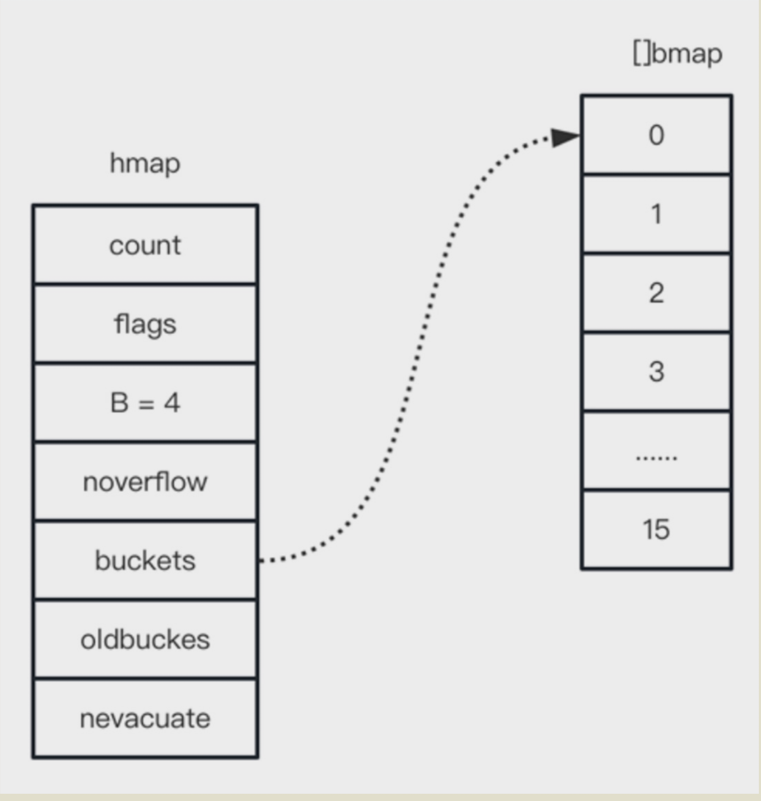
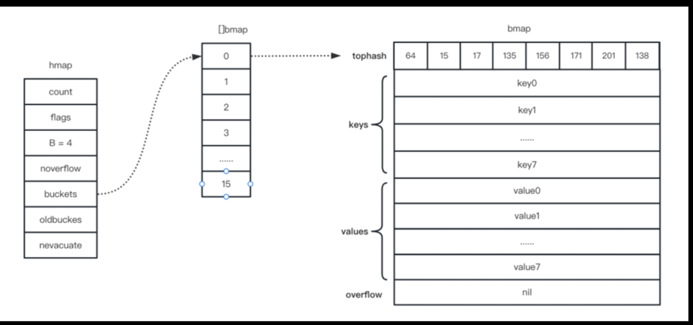

type hmap struct {
    count       int             // 元素个数
    flags       uint8
    B           uint8           // 桶个数的对数，这意味着整个map结构中含有2^B个桶
    noverflow   uint16          // 溢出桶的个数
    hash0       uint32          // hash种子

    buckets     unsafe.Pointer  // map的底层是一个桶的数组，buckets是该数组的指针
    oldbuckets  unsafe.Pointer  // 当发生桶迁移时，指向旧桶的一个指针
    nevacuate   uintptr         // 迁移进度

    extra *mapextra
}

type bmap struct {
    tophash     [8]uint8
    keys        [8]keytype
    values      [8]valuetype
    pad         uintptr
    overflow    uintptr
}

